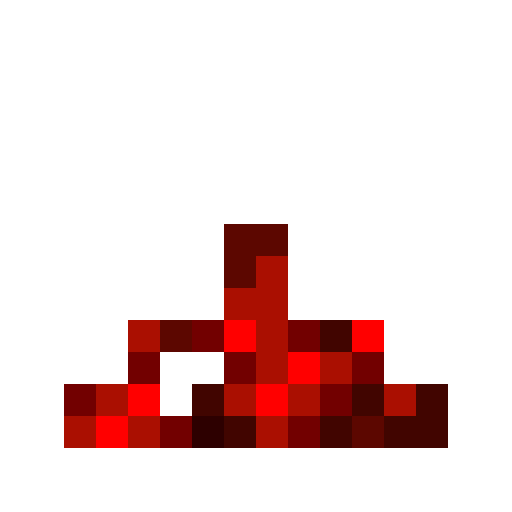

<div align="center">



# RedstoneLab

</div>

RedstoneLab is a lightweight software to help redstoners  by providing the same thing as redstone in Minecraft but without the not needed things of Minecraft to do redstone.

<!--

## Screenshots>


-->

## Features

- Light/dark mode toggle
- Live previews
- Fullscreen mode
- Cross platform

## Installation

Install by cloning the repository:

```bash
git clone https://github.com/foxypiratecove37350/RedstoneLab
cd RedstoneLab
```

And then, start it using Python:

```bash
python src/main.py
```

## Contributing

Contributions are always welcome!

See [`CONTRIBUTING.md`](./CONTRIBUTING.md) for ways to get started.

Please adhere to this project's code of conduct.

## License

This project is under the GNU General Public License v2.0, see [`LICENSE`](./LICENSE) for more informations.
